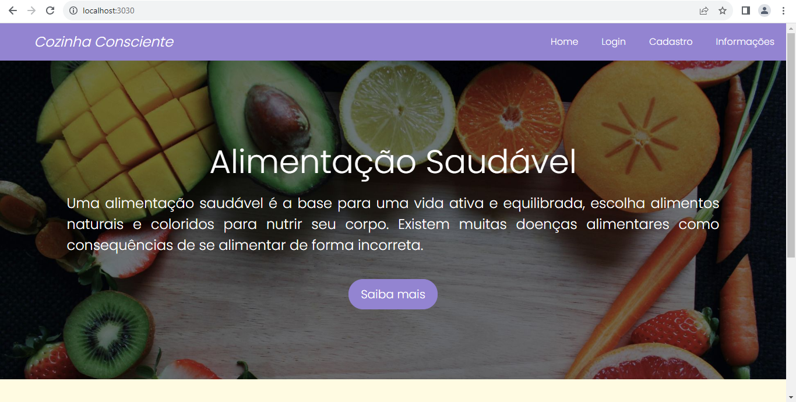

<style>
  @import url('https://fonts.googleapis.com/css2?family=Poppins:wght@300&display=swap');
  body{
    font-family: 'Poppins', sans-serif;
  }
</style>
<h1 align='center' style='letter-spacing: .3rem'> Iniciando projeto</h1>
  

##
<div>
<h3 style='font-size: 2rem'>💻 Primeiros passos</h3>
<ul style='font-size: 1.5rem'>
  <li>Primeiro instale o <a href='https://nodejs.org/en' style='text-decoration: none'>Node.js</a></li>
  <li>Segundo, abra o Vs Code com o projeto</li>
  <li>Terceiro, abra o terminal na pasta do projeto e digite os comandos a seguir:</li>
</ul>

```javascript
  npm install
  npm run start-dev
```
</div>

##
<div>
<h3 style='font-size: 2rem'>🔎 Navegador</h3>
<ul style='font-size: 1.5rem'>
  <li>Abra seu navegador de preferência</li>
  <li>Então pesquise por: </li><br>

    localhost:3030
</ul>
</div>

##
<div>
<h3 style='font-size: 2rem'>🧾 Resultado</h3>
   
</div>
